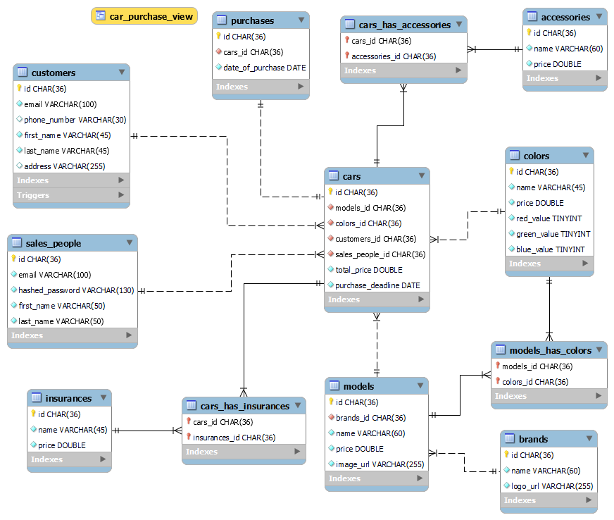

# 10a [Individual] Document A Database

**Type**: Individual

Use a **tool** to document any database.


# MySQL Dump Documentation

Dumping a database schema captures its structure and data, providing a clear reference for design, troubleshooting, and restoration.

## How to execute dumping

In the terminal use the command:

```sh
python dump_mysql.py
```

Or to do the same without the dump_mysql.py script, within a **GitBash** terminal:

```bash
$ mysqldump --user=<username> --password=<user_password> --host=localhost --port=3306 --no-tablespaces kea_cars_dev > mysql-dump/dump_$(date +%s).sql
```


# EER Diagram Documentation

An Enhanced Entity-Relationship Diagram (EERD) visually represents a database's structure, showing entities, attributes, and relationships.

This can be seen in the [EERD_kea_cars_dev.png](EERD_kea_cars_dev.png)

<details>
  <summary>Click to view the EER Diagram</summary>

  

</details>

## How to generate an EER diagram using **MySQL Workbench**

Link: https://www.mysql.com/products/workbench/

Usage: 
Open MySQL Workbench > Database > Reverse Engineer > follow wizard 
- Choose a stored connection or set connection parameters for a new DBMS. > Next
- Connect to a DBMS > Next
- Select Schemas you want to include (kea_cars_dev) > Next
- Retrive Objects > Next
- Select Objects (Import table, view, routine, and trigger objects) > Execute
- Reverse Engineer > Next
- Results > Finish

File > Export > Export as PNG > Pick folder to save PNG of the EERD


# MRO Documentation

**MRO** (Model Relations to Objects) is a tool for documenting an existing database by analyzing its structure and generating files that describe how it is organized. Unlike an ORM, which creates a database from code, MRO works in reverse by reading the database schema and turning it into documentation.

In simple terms, MRO takes a snapshot of your database's structure and creates files that are easy to read and share, making it useful for developers, stakeholders, and future maintenance.

## Using MRO with `npx`

You can run MRO using `npx`, which allows you to execute it without installing it globally. For example:

```bash
npx mro generate
```

This command connects to the database specified in the `.env` file, analyzes its schema, and generates output files. The `.env` file contains the database connection details, such as the host, port, username, password, and database name.

When you run the command, MRO uses this information to connect to the `kea_cars_dev` database and generate files that document its structure.

## How MRO Helps Document a Database

MRO simplifies database documentation by extracting the schema and generating files. In this project, we use MRO to create two types of documentation:

1. **HTML File**: A human-readable file that visually represents the database schema, ideal for sharing with stakeholders or team members.
2. **JSON File**: A structured file containing detailed information about the database schema, useful for developers who need programmatic access.

The generated documentation is located in the `mro` directory alongside the `.env` file. Run the `npx mro generate` command from this directory to create the documentation. During execution, you will make the following choices:

1. **Choose a Database**: Select the type of database. For this project, the choice is **MySQL**.
2. **Output Format**: Choose between **JSON** or **HTML Documentation**.
3. **Key-Value Pairs**: Select details to include:
   - **Field**: Names of the fields (columns) in the database tables.
   - **Type**: Data types of the fields (e.g., INT, VARCHAR).
   - **Key**: Information about primary and foreign keys.
   - **KeyTo**: Relationships between tables (e.g., which foreign key points to which table).
4. **Select Tables**: For HTML documentation, select which tables to include. We choose **all tables**. (This step is not needed for JSON as it includes all tables by default.)


### MRO: Generate HTML Documentation

The HTML file, located at [`mro/kea_cars_dev_mro_docs.html`](mro/kea_cars_dev_mro_docs.html), visually represents the database schema. Open it in any web browser to view tables, fields, and relationships. It is useful for sharing with stakeholders or as a reference for developers.

### MRO: Generate JSON Documentation

The JSON file, located at [`mro/kea_cars_dev.json`](mro/kea_cars_dev.json), provides a detailed, machine-readable representation of the database schema. Open it in a text editor or JSON viewer. It is ideal for developers needing programmatic access or integration with tools.