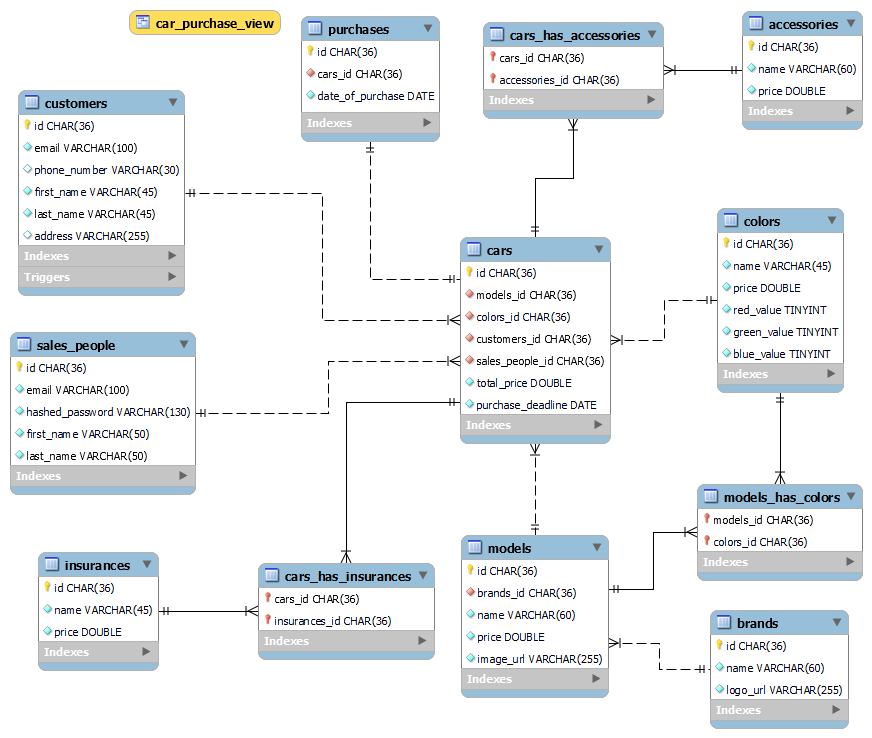

# MySQL Dump Documentation

Dumping a database schema, like an SQL file, serves as a form of database documentation by capturing the structure and data of the database at a specific point in time. This provides a clear reference for database design, facilitates troubleshooting, and ensures easy restoration or migration of the database when needed.

## How to execute dumping

In the terminal use the command:

```sh
python dump_mysql.py
```

Or to do the same without the dump_mysql.py script, within a **GitBash** terminal:

```bash
$ mysqldump --user=<username> --password=<user_password> --host=localhost --port=3306 --no-tablespaces kea_cars_dev > mysql-dump/dump_$(date +%s).sql
```


# EER Diagram Documentation

An Enhanced Entity-Relationship Diagram (EERD) is a detailed visual representation of a database's structure. It extends the basic Entity-Relationship Diagram (ERD) by including additional concepts such as specialization, generalization, and categories. EERDs document the entities, their attributes, and the relationships between them, providing a comprehensive overview of the database schema.

EERDs are used to design and document databases by offering a clear and structured way to understand the relationships and constraints within the database. This helps developers and stakeholders communicate effectively, ensures consistency in database design, and simplifies future maintenance or updates to the database.

This can be seen in the [EERD_kea_cars_dev.png](EERD_kea_cars_dev.png)

<details>
  <summary>Click to view the EER Diagram</summary>

  

</details>

## How to generate an EER diagram using **MySQL Workbench**

Link: https://www.mysql.com/products/workbench/

Usage: 
Open MySQL Workbench > Database > Reverse Engineer > follow wizard 
- Choose a stored connection or set connection parameters for a new DBMS. > Next
- Connect to a DBMS > Next
- Select Schemas you want to include (kea_cars_dev) > Next
- Retrive Objects > Next
- Select Objects (Import table, view, routine, and trigger objects) > Execute
- Reverse Engineer > Next
- Results > Finish

File > Export > Export as PNG > Pick folder to save PNG of the EERD


# MRO Documentation

**MRO** stands for **Model Relations to Objects**. It is a tool designed to help document an existing database by analyzing its structure and creating files that describe how the database is organized. 

Unlike an ORM (Object-Relational Mapping), which starts with code and generates a database schema, MRO works in reverse. It connects to an already existing database, reads its schema (tables, columns, relationships, and constraints), and generates files that represent this structure. These files act as documentation, making it easier to understand how the database is built and how its components relate to each other.

In simpler terms, MRO is like taking a snapshot of your database's blueprint and turning it into files that are easy to read and share. This is especially useful for projects where you need to document the database for developers, stakeholders, or future maintenance.

By using MRO, we can ensure that the database is well-documented, making it easier to understand, maintain, and share with others.

## Using MRO with `npx`

You can run MRO using `npx`, which allows you to execute it without installing it globally. For example:

```bash
npx mro generate
```

This command connects to the database specified in the `.env` file, analyzes its schema, and generates output files. The `.env` file contains the database connection details, such as the host, port, username, password, and database name. For example:

```
DB_HOST=localhost
DB_PORT=3306
DB_USER=root
DB_PASSWORD=your_password
DB_NAME=kea_cars_dev
```

When you run the command, MRO uses this information to connect to the `kea_cars_dev` database and generate files that document its structure.

## How MRO Helps Document a Database

MRO is particularly useful for documenting databases because it automates the process of extracting the database schema and representing it in a clear and organized way. In this project, we will use MRO to generate two types of files:

1. **HTML File**: A human-readable file that visually represents the database schema. This is ideal for sharing with stakeholders or team members who need a quick overview of the database structure.
2. **JSON File**: A structured file that contains all the details of the database schema, such as tables, columns, relationships, and constraints. This file is useful for developers who need a programmatic way to understand the database.

The generated documentation is located in the `mro` directory alongside the `.env` file. This is also the directory where the `npx mro generate` command should be executed.

When running the `npx mro generate` command, you will be prompted to make several choices. These choices determine how the documentation is generated and what it includes:

1. **Choose a Database**:  
   This option allows you to specify the type of database you are documenting. For this project, the choice is **MySQL**, as the database we are documenting is built using MySQL.

2. **Output Format**:  
   This option determines the format of the generated documentation. You can choose either **JSON** or **HTML Documentation**, depending on which type of documentation you are generating.

3. **Key-Value Pairs**:  
   This step allows you to toggle on or off various details to include in the documentation. The options are:

   - **Field**: Includes the names of the fields (columns) in the database tables.
   - **Type**: Includes the data types of the fields (e.g., INT, VARCHAR).
   - **Default**: Includes the default values for the fields, if any are defined in the database schema.
   - **Null**: Indicates whether a field allows `NULL` values.
   - **Key**: Includes information about primary and foreign keys in the database.
   - **KeyTo**: Includes details about the relationships between tables (e.g., which foreign key points to which table).
   - **Extra**: Includes additional information about the fields, such as auto-increment properties.
   - **TypeJS**: This option is only available when generating **JSON Documentation**. It includes JavaScript-compatible data types for the fields, which can be useful for developers working with JavaScript-based applications.

   For both JSON and HTML documentation, we select **Field**, **Type**, **Key**, and **KeyTo**.


4. **Select Tables**:  
   This option is only available when generating **HTML Documentation**. It allows you to select which tables to include in the documentation. Since the JSON format includes all tables by default, this step is not necessary for JSON. For HTML documentation, we select **all tables** to ensure the entire database schema is documented.


### MRO: Generate HTML Documentation

The HTML file generated by MRO, located at [`mro/kea_cars_dev_mro_docs.html`](mro/kea_cars_dev_mro_docs.html), provides a visual and human-readable representation of the database schema. It includes details about the tables, fields, and relationships within the database, making it easy to understand the structure at a glance.

This file is particularly useful for sharing with stakeholders or team members who may not have technical expertise but need a clear overview of the database. It can also be used as a reference for developers during database maintenance or further development.

To view the HTML documentation:
1. Navigate to the `mro` directory where the file is located.
2. Open the `kea_cars_dev_mro_docs.html` file in any web browser.

The HTML format ensures that the documentation is accessible and easy to navigate, making it a valuable resource for understanding and communicating the database structure.


### MRO: Generate JSON Documentation

The JSON file generated by MRO, located at [`mro/kea_cars_dev.json`](mro/kea_cars_dev.json), contains a detailed and structured representation of the database schema. It includes information about tables, columns, relationships, and constraints in a machine-readable format.

This file is particularly useful for developers who need to programmatically analyze or interact with the database schema. It can be used in applications or scripts to automate tasks such as generating code, validating schemas, or integrating with other tools that require database structure information.

To view the JSON documentation:
1. Navigate to the `mro` directory where the file is located.
2. Open the `kea_cars_dev.json` file in any text editor or JSON viewer.

The JSON format provides a flexible and structured way to work with the database schema, making it an essential resource for developers who need detailed and programmatic access to the database structure.